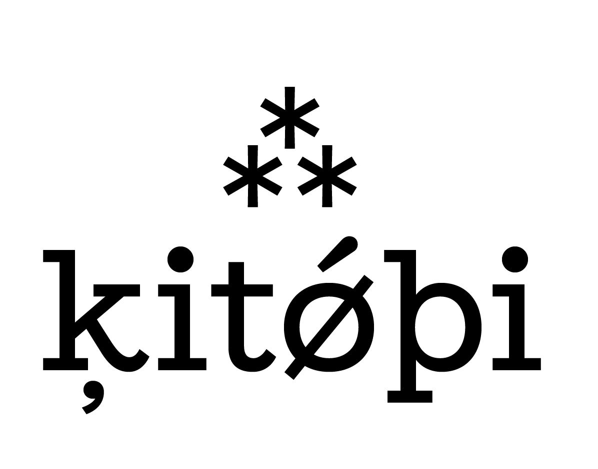

<p align="center">
  <picture>
    <source media="(prefers-color-scheme: dark)" srcset="kitabilogo-white.png">
    
  </picture>
</p>

# Kitabi Kurulum — Sorun Giderme Rehberi

Bu rehber kurulumun her adımında karşılaşabileceğin sorunlar için. Baştan sona okumana gerek yok — kurulumda hangi adımda takıldıysan sadece o bölüme bak.

İçindekiler ile aradığın bölüme atlayabilirsin.

📧 **İletişim**: poeple.api@gmail.com — burada cevap bulamadığın sorun olursa.

---

## İçindekiler

- [Genel kurulum öncesi sorular](#genel-kurulum-oncesi)
- [Adım 1: Telegram bot oluşturma](#adim-1-telegram)
- [Adım 2: Gemini API anahtarı](#adim-2-gemini)
- [Adım 3: GitHub'da fork](#adim-3-github)
- [Adım 4: Google Cloud Project](#adim-4-gcp)
- [Adım 5: Secret Manager](#adim-5-secrets)
- [Adım 6: Cloud Run'a deploy](#adim-6-deploy)
- [Adım 7: Webhook bağlantısı](#adim-7-webhook)
- [Yeni özelliklere özel sorunlar](#yeni-ozellikler)
- [Bot çalışmıyor / mesajıma cevap vermiyor](#bot-cevap-vermiyor)
- [Veri kaybı, log'lar, izinler](#genel-sorunlar)

---

## Genel kurulum öncesi sorular {#genel-kurulum-oncesi}

### Hiç kod bilmiyorum, bunu kullanabilir miyim?

Evet. Kurulum sihirbazı seni tüm adımlardan geçirir, sen sadece tıklamalar yapıp yapıştırmalar yapacaksın. Bu rehber de takıldığın yerleri çözmek için. Linux/terminal/komut bilgisi gerekmiyor.

### Gerçekten 0 TL mi tutar?

Evet. Kullanılan tüm servisler ücretsiz katmanlarda — Telegram, Gemini, Google Cloud Run, Cloud Storage, Secret Manager, GitHub. Kitabi'nin kişisel kullanım yükü bu limitlerin çok altında. Detaylar kurulum sihirbazının ilk sayfasında.

### Ne kadar sürer?

İlk kez yapıyorsan ~30-45 dakika. Yarın güncelleme yaparsan ~2 dakika (sadece kod push'la).

### Google hesabım yok, ne yapayım?

[accounts.google.com/signup](https://accounts.google.com/signup) → Gmail oluştur. Telefon numarası istenir, doğrulama SMS'i gelir. ~3 dakika. Sonra Kitabi kurulumuna döner, "Gmail ile giriş yap" tüm adımlarda aynı hesabı kullanırsın.

### Telegram hesabım yok

Telefonun var mı? [telegram.org](https://telegram.org) → uygulamayı indir → telefon numaranı gir → SMS kodu → tamam. Kullanıcı adı seçmen gerekmiyor.

### Mac/Windows fark eder mi?

Hayır. Tüm kurulum tarayıcı içinde yapılıyor. İşletim sisteminin önemi yok.

### Telefonda kurulum yapabilir miyim?

Teorik olarak evet (sihirbaz mobile responsive), ama bilgisayar daha kolay — birden çok sekme açacaksın, kopyala-yapıştır yapacaksın.

---

## Adım 1: Telegram bot oluşturma {#adim-1-telegram}

### BotFather'ı bulamıyorum

Telegram'ı aç → üstteki arama çubuğuna `@BotFather` yaz → mavi tikli olanı seç (verified). Sahte taklitleri var — mavi tik şart.

Direkt link: [t.me/BotFather](https://t.me/BotFather)

### `/newbot` yazınca cevap gelmedi

BotFather'a "Start" demediysen, önce alttaki **START** butonuna bas. Sohbet başladıktan sonra `/newbot` çalışır.

### Bot adı kabul edilmiyor

İlk soruda BotFather "name" istiyor — bu **görünür ad**. İstediğin karakterleri yazabilirsin (Türkçe karakter dahil): "Kitabi", "Okuma Botu", "Benim Kitabim"...

### Username kabul edilmiyor — "Sorry, this username is already taken"

Username'ler global benzersiz; `kitabi_bot`, `kitabi_app_bot` gibi popüler isimler dolu olabilir. Sonuna sayı veya kendine özgü bir kelime ekle:
- `kitabi_okuma_2026_bot`
- `kitabi_okur_bot`
- `benim_kitabim_okuma_bot`

Kurallar: harf+rakam+`_`, 5-32 karakter, **mutlaka `bot` ile bitmeli**.

### Token nedir, nasıl saklayacağım?

BotFather'ın verdiği `123456789:ABCdefGhIjKlMnOpQrStUvWxYz` şeklindeki uzun yazı **bot token'ı**. Bu **botun şifresi** — kim onu alırsa botun sahibi gibi davranabilir.

**Yapacakların:**
1. Token'ı seç, kopyala
2. Notepad / TextEdit aç, yapıştır, kaydet (geçici)
3. Adım 5'te Google Cloud Secret Manager'a yapıştır
4. Notepad'i sil

**Yapmaman gerekenler:**
- Tokeni e-postaya, mesaja, social media'ya yazma
- Kod dosyalarına yapıştırma
- Screenshot alıp herhangi bir yere göndererek paylaşma

### Token'ı kaybettim

Sorun değil. BotFather'da `/token` yaz → bot'unu seç → yeniden gösterir. Eski token iptal olmaz, yeni de aynı token döner. Eğer "yeni token istiyorum, eskisi sızdı" diyorsan `/revoke` ile iptal edip yeni alabilirsin.

### Birden fazla bot mu yarattım?

Sorun değil. BotFather'a `/mybots` yaz, listele. Kullanacağını seç, gerisi de durabilir (sınır yok ama temiz tutmak istersen `/deletebot`).

### userinfobot ID'mi söylemiyor

[@userinfobot](https://t.me/userinfobot) → START → otomatik ID'ni yazar. Eğer yazmazsa herhangi bir mesaj yaz, cevap olarak gelir.

**Önemli:** Telegram **username**'ini değil, **ID**'ni (sadece rakamlardan oluşan numara) kaydedeceksin.

---

## Adım 2: Gemini API anahtarı {#adim-2-gemini}

### Google AI Studio sayfası açılmıyor

URL: [aistudio.google.com/app/apikey](https://aistudio.google.com/app/apikey)

Açılmıyorsa:
- Google hesabınla giriş yaptın mı? Sağ üstte profil resmi görünmeli
- Ülke kısıtı olabilir — Google AI bazı ülkelerde kısıtlı. VPN ile (örn. Almanya) dene
- Tarayıcıyı yenile, cache temizle

### "Create API Key" butonu gri / tıklanmıyor

İki sebep var:
1. Bir Google Cloud Project'in yok — "Create API key in new project" seçeneğini bul, kabul et. Otomatik bir project açar.
2. Hesabın yeni; Google bazen birkaç saat onaylama bekler. Tekrar dene.

### API key formatı `AIza...` ile başlamıyor

Bu yanlış key olabilir. API key 39 karakter uzunluğunda, `AIzaSy...` ile başlar. Tekrar oluştur, doğru olanı kopyala.

### API key kaybettim

AI Studio → API keys → varolan anahtarın yanında "Show key" tıkla, görünür. Kaybettiğin diye yeni oluşturmana gerek yok.

### Quota aşıldı diyor (429 hata)

Gemini ücretsiz limit: 10 istek/dakika, 250/gün.
- Saat veya gün sınırına geldiysen bekle
- Veya başka bir API key (başka Google hesabıyla) oluştur — pratikte zor olur, kişisel kullanımda 250 RPD'yi geçmek zor

### Gemini cevap vermiyor / "API key invalid"

Önce key'i kopyaladığından emin ol — başında/sonunda boşluk olmamalı.
Sonra `https://generativelanguage.googleapis.com/v1beta/models?key=YOUR_KEY` URL'sini tarayıcıda aç (KEY yerini sen koy). Liste dönerse key çalışıyor; "API key not valid" dönerse key yanlış.

---

## Adım 3: GitHub'da fork {#adim-3-github}

### GitHub hesabım yok

[github.com/signup](https://github.com/signup) → e-mail + username + şifre → mail doğrulama → tamam. 2 dakika. Kredi kartı yok.

### Doğrulama maili gelmedi

Spam klasörüne bak. Hâlâ yoksa `Resend verification email` butonu var.

### Fork butonunu bulamıyorum

Repo sayfasının sağ üst köşesinde **"Fork"** yazılı bir buton vardır (yıldız ve "Watch"un yanında).

Direkt fork URL: [github.com/poeple-app/kitabi/fork](https://github.com/poeple-app/kitabi/fork) — bu link doğrudan fork ekranını açar.

### "Authorize Cloud Run" mesajı çıktı

Bu Cloud Run'ın senin GitHub repolarını okuma izni istemesi (sadece public olanları zaten okuyabiliyor, ama bu izin private repoları da kapsıyor). Güvenli, "Authorize" ile devam et.

### Fork ettim ama URL'ini bulamıyorum

GitHub → profilin → repos sekmesi → "kitabi" listede. URL'i `https://github.com/<kullaniciAdin>/kitabi` şeklinde. Kurulumda bu URL'i (sondaki `/fork` olmadan!) gireceksin.

### "Repository name 'kitabi' already exists in your account"

Daha önce forklamışsın. İki seçenek:
1. Eski fork'u sil (Settings → Danger Zone → Delete) ve tekrar fork yap
2. Eski fork'u kullan; ama güncel kodu çekmek için repo sayfasında "Sync fork" yap

### Repo gözükmüyor / private

Default'ta fork public olur. Eğer sehven private yaptıysan, deploy.cloud.run repoya erişemez. Repo settings → General → Visibility → "Make public".

---

## Adım 4: Google Cloud Project {#adim-4-gcp}

### Google Cloud Console açılmıyor

[console.cloud.google.com](https://console.cloud.google.com) — Gmail ile giriş yap.

Açılmıyorsa:
- Çıkış yapıp yeniden gir
- Farklı tarayıcı dene
- Adblocker'ı bu site için kapat

### Hizmet şartları kabul etmem isteniyor

İlk girişte normal. Kabul et, devam et. Ücret yok.

### Project oluşturmak istemiyor — "create a new project" yok

Sağ üstte proje seçici (logo'nun yanında "Select a project" yazıyor) → tıkla → açılan pencerede sağ üstte **"NEW PROJECT"**.

### Kredi kartı isteniyor — para çekecek mi?

Hayır. Google Cloud'un free tier'ı "trial" değil, "always free". Kart sadece kimlik doğrulama için (bot yapımı engellemek için). Kitabi'nin kullanımı ücretsiz limit içinde, kart'tan ödeme alınmaz.

**Eğer kart vermek istemiyorsan:**
- "Skip" / "Maybe later" seçeneği bazen var, "Cancel" değil
- Kart vermeden de Cloud Run / Storage / Secret Manager ücretsiz limitlerde kullanılabilir, ama bazı hesaplarda zorunlu
- Alternatif: prepaid (önödemeli) kart ile aç

### Project ID nedir?

Project oluştururken sen "Project name" giriyorsun (örn. "Kitabi"). Google otomatik bir **Project ID** üretiyor (örn. `kitabi-487291`). ID benzersiz ve değiştirilemez.

Project ID'i bulmak için: Console üst kısımda project adının yanında küçük yazıyla görünür. Veya **Dashboard** → "Project info" kutusu.

### API'leri aktifleştiremiyorum

API enable sayfası: `console.cloud.google.com/apis/library`. Tek tek arama yapıp her birini "Enable" yapabilirsin, veya kurulumdaki "4 API'yi tek tıkla aç" linki dördünü birden açar.

İsim listesi (manuel yapacaksan):
- Secret Manager API
- Cloud Run Admin API
- Cloud Storage API
- Artifact Registry API

### "Billing account required"

Bazı API'ler billing account (kart) bağlı bir project gerektirir. Yukarıdaki "Kredi kartı isteniyor" bölümüne bak.

### Çok project'im var, hangisi kullanılıyor?

Console'un üst kısmında aktif project'in adı yazıyor. Kurulumda Project ID girerken aktif project'i yazıyorsun. Yanlış project'i seçtiysen sağ üstten değiştir.

---

## Adım 5: Secret Manager {#adim-5-secrets}

### Secret Manager menüsünde göremiyorum

Console sol menüde "Security" altında. Yoksa:
- API'leri aktifleştirmedin (Adım 4) — geri dön, Secret Manager API'yi etkinleştir
- Project değiştir (üstte aktif project'in adı kontrol et)

Direkt link (Project ID girersen): `console.cloud.google.com/security/secret-manager?project=<PROJECT_ID>`

### "Permission denied"

Project sahibi sensin değil mi? Eğer ortak project'tesen, Owner / Editor / Secret Manager Admin rolü gerek. Kendi project'inse normalde tüm yetkiler sende olur.

### "Create Secret" formu açılmıyor

Adblocker veya privacy uzantısı engelliyor olabilir. Adblocker'ı kapat.

### Secret değer alanı boş gözüküyor

Form scroll'lanması gerek. "Secret value" başlığı altında büyük bir textarea var. Eğer hâlâ göremiyorsan farklı tarayıcı dene.

### Secret adını yanlış mı yazdım?

Adlar **tam olarak şu olmalı** (büyük-küçük harf hassas):
- `telegram-bot-token`
- `allowed-tg-user-ids`
- `gemini-api-key`
- `webhook-secret`

Yanlış yazdıysan Secret Manager'da o secret'ı seç → "DESTROY" → tekrar oluştur. Veya doğru adla yeni bir secret oluştur ve eskisini görmezden gel.

### Webhook secret üreteci çalışmıyor

Kurulum sayfası tarayıcının `crypto.getRandomValues` API'sini kullanıyor. Modern tarayıcılarda çalışır. Eski tarayıcı kullanıyorsan güncelle.

Alternatif olarak terminal'inde manuel üretebilirsin:
- macOS/Linux: `openssl rand -hex 32`
- Windows PowerShell: `$bytes = New-Object byte[] 32; [System.Security.Cryptography.RandomNumberGenerator]::Create().GetBytes($bytes); ([System.BitConverter]::ToString($bytes) -replace '-','').ToLower()`

### Service account'un izni nasıl?

Eğer veri kaydedilmiyor uyarısı gelirse: Cloud Run service account'unun GCS bucket'a yazma yetkisi olmalı.

```
gcloud projects add-iam-policy-binding <PROJECT_ID> \
  --member="serviceAccount:<PROJECT_ID>-compute@developer.gserviceaccount.com" \
  --role="roles/storage.objectAdmin"
```

Cloud Shell'de bu komutu çalıştır.

---

## Adım 6: Cloud Run'a deploy {#adim-6-deploy}

### Deploy sayfası açılmıyor

[deploy.cloud.run/?git_repo=<REPO_URL>](https://deploy.cloud.run) — repo URL'ini parametre olarak almalı. Kurulum sihirbazı bunu otomatik üretir.

Açılmıyorsa: Console'da [Cloud Run](https://console.cloud.google.com/run) → "Create service" → "Continuously deploy from a repository" → GitHub provider seç.

### Build başarısız oldu — "FAILED" görüyorum

Build log'larına bak (Cloud Run service → "BUILD LOGS"). Yaygın sorunlar:
- **Dockerfile yok**: repo'da `Dockerfile` olmalı (varolan kodda var; eğer kendi fork'un eskiyse Sync Fork yap)
- **Bağımlılık çakışması**: `pip install` aşamasında patladıysa `pyproject.toml`'da bir paket bozulmuş — issue aç
- **Memory yetmedi**: build için varsayılan 2 GB yetmez bazen. Build settings → "Compute" → "8 GB" gibi yüksek seç (sadece build için, runtime memory ayrı)

### Authentication "Allow unauthenticated invocations" göremiyorum

Deploy sırasında "Authentication" bölümünde iki seçenek var:
- Allow unauthenticated invocations
- Require authentication

Birincisini seç. Webhook için gerekli; kötü amaçlı erişimi `webhook-secret` engelliyor.

### Secret bağlama (Reference a secret) nasıl yapılır?

Deploy sayfası → "Variables & Secrets" bölümü → "Reference a Secret" butonu.

Her secret için:
1. Reference a Secret → seç
2. Environment variable name (sol kolon): `TELEGRAM_BOT_TOKEN` (büyük harf, alt çizgi)
3. Secret (sağ kolon): `telegram-bot-token` (küçük harf, tire)
4. Version: `latest`
5. "Done"

Aynısını şu 4 secret için tekrarla:
- `TELEGRAM_BOT_TOKEN` ← `telegram-bot-token:latest`
- `WEBHOOK_SECRET` ← `webhook-secret:latest`
- `ALLOWED_TG_USER_IDS` ← `allowed-tg-user-ids:latest`
- `GEMINI_API_KEY` ← `gemini-api-key:latest`

Ayrıca düz env vars:
- `GCS_BUCKET_NAME` ← (sen oluşturduğun bucket adı)
- `BOT_BASE_URL` ← Cloud Run servisi deploy'dan sonra verdiği URL — ilk deploy'da boş bırak, sonra update yap

### Deploy bitti ama URL gelmedi

Service detail sayfasında üstte "URL" yazısı var (`https://kitabi-xxxxx-ew.a.run.app` gibi). Eğer yoksa deploy henüz bitmemiş veya hata almış.

### Cold start çok uzun (>30 sn)

İlk açılışta normal — container indiriliyor, Python paketleri yükleniyor, DB bağlanıyor. Sonraki istek hızlı olur (~1-2 sn).

Eğer her seferinde uzun: `min-instances=1` yapabilirsin (cold start tamamen yok ama ücretsiz limit aşılabilir).

### Servis URL'i değişti

Deploy ile her revision yeni URL döndürebilir (eski URL de çalışır). Eski URL'i `BOT_BASE_URL`'de tutuyorsan webhook patlar.

### "Permission denied on secret" — deploy failed

Hata mesajı: `Permission denied on secret: projects/XXX/secrets/telegram-bot-token/versions/latest for Revision service account XXX-compute@developer.gserviceaccount.com`

Cloud Run default service account'a Secret Manager erişimi verilmemiş. Cloud Shell'de:

```bash
SA=<PROJECT_NUMBER>-compute@developer.gserviceaccount.com

gcloud projects add-iam-policy-binding <PROJECT_ID> \
  --member="serviceAccount:$SA" \
  --role="roles/secretmanager.secretAccessor"
```

`PROJECT_NUMBER`'ı hata mesajından alırsın (servis account adındaki sayı). Sonra Cloud Run → kitabi → **EDIT & DEPLOY NEW REVISION** → DEPLOY.

Aynı şekilde **Cloud Storage** erişimi de gerek (GCS backup için):

```bash
gcloud storage buckets add-iam-policy-binding gs://<BUCKET_NAME> \
  --member="serviceAccount:$SA" \
  --role="roles/storage.objectAdmin"
```

### "Container failed to start and listen on the port" — deploy failed

Container Python tarafında bir exception ile patlamış, port 8080'i dinleyemedi. **Container ayarları yanlış değil**, içerdeki kodda problem var.

Log'a bak:

```bash
gcloud run services logs read kitabi --region=europe-west1 --project=<PROJECT_ID> --limit=100 | grep -A 60 Traceback
```

Traceback'in en altındaki satır gerçek sebep. Yaygın olanlar:

#### `pydantic_core._pydantic_core.ValidationError: ... allowed_tg_user_ids ... Input should be a valid list`

`ALLOWED_TG_USER_IDS` secret'ı tek bir sayı içeriyor (örn. `123456789`) — eski versiyon kodda bu int olarak parse ediliyordu. **Kod her formatı kabul eder** (tek int, virgüllü string, JSON array). Eğer hâlâ bu hatayı alıyorsan kodun eski sürümde:
1. Repo'da en son main.py'yi kullandığından emin ol
2. ya da secret değerini `[123456789]` (köşeli parantezli) olarak güncelle + new version oluştur + redeploy

#### `pydantic_core._pydantic_core.ValidationError: ... field required ...`

Bir secret veya env değişkeni eksik. Hata mesajı hangi field olduğunu söyler. Cloud Run → kitabi → **Variables & Secrets** sekmesini kontrol et — 4 secret (TELEGRAM_BOT_TOKEN, WEBHOOK_SECRET, ALLOWED_TG_USER_IDS, GEMINI_API_KEY) bağlanmış olmalı + 2 env (`GCS_BUCKET_NAME`, `DB_PATH`).

#### `google.api_core.exceptions.NotFound: 404 ... Bucket "..." not found`

`GCS_BUCKET_NAME` env'i yanlış. Bucket adın Cloud Storage'da gerçekten var mı kontrol et:

```bash
gcloud storage buckets list --project=<PROJECT_ID>
```

---

## Yeni özelliklere özel sorunlar {#yeni-ozellikler}

### OCR'da yine "bazen" gibi vurgu dışı kelimeler eklendi
OCR için 3 katmanlı iyileştirme uygulanıyor:
- `temperature=0` — vision çağrılarında karar tutarlılığı
- Chain-of-thought — model önce sayfayı analiz eder, sonra çıkar
- Renk tespiti zorunluluğu — `RENK:` satırı modelden vurguya dikkat etmesini ister

Hâlâ taşma görüyorsan:
- Vurgu kenarı bulanık çekilmiş olabilir — kalemi ya da fosforu daha belirgin çek
- "Aday" kelimenin tam sınırda olması: model "yarım kelime alma, tamamını al" diyor, yine de bir sonraki kelimeye geçmez. Eğer geçiyorsa loglarda `ai.ocr_image.success color_detected` field'i ne diyor bak — model rengi tespit edemediyse vurguyu da net göremiyor demektir.

### Kelime ortasında tire ve satır sonu — "tahak- küm" diye kaydedildi
OCR ve foto+caption cevaplarında otomatik post-processing var: `r'(\w)-\s*\n\s*(\w)'` regex'i satır sonu kelime kırılmalarını birleştirir. Eski notlarda var olan tireler şu anlık DB'de kalır; yeni notlarda görünmez.

Eski notları düzeltmek için: not detay → "✏️ Transkripti düzelt" → tire'siz versiyonu yapıştır.

### Not detayında fotoğraf görünmüyor
Not açıldığında varsa fotoğrafı caption ile birlikte gösterir. Görünmüyorsa:
- Not, fotoğraf desteği eklenmeden önce oluşturulmuş olabilir → `photo_file_id` boş, gösterecek bir şey yok
- Telegram file_id 18 ay valid; daha eski fotoğraflar artık indirilemez
- Container eski revision'da olabilir → `/healthz` versionunu kontrol et

### Gemini cevabında "Kaynak:" footer'ı yok
PROMPT_ANSWER "Kaynak: KOD1, KOD2" footer'ını zorunlu kılar. Görünmüyorsa:
- Soru cevaplama akışı (`question:ask`) dışındaki AI yanıtları (explain, define_term) kaynak vermez — sadece "soru sor" akışında var
- Gemini bazen formattan sapabilir; bu durumda `_split_answer_and_sources` bulamayınca cevap olduğu gibi gösterilir, kaynak satırı çıkmaz
- "bilgi tabanı" diye dönüyorsa Gemini notlardan değil kendi bilgisinden cevapladı demektir — şeffaflık için doğru davranış

### Buton tıkladığımda hâlâ feedback gelmiyor
Her callback ilk 50ms içinde "⏳ Hazırlanıyor…" toast'u atar. Görmüyorsan:
- Toast Telegram'ın native popup'ı — bazı eski mobil sürümlerde küçük görünür, üst banner alanına yakın bak
- Eski revision olabilir → `/healthz` versionunu kontrol et

### "Tek aktif menü" hâlâ iki menü gösteriyor
`handle_text/voice/photo` başlarındaki `_delete_previous_menu` çağrıları + `_send_screen` callback dalı "tracked başka menü" varsa onları siler. Hâlâ görüyorsan:
- Silinemeyen menü 48 saatten eski → Telegram silmeye izin vermiyor, sahnede kalıyor
- Bot bazı durumlarda track edilmemiş ekstra mesaj atmış olabilir (örn screen_note_confirm sonrası reply_text). Bu mesajlar henüz takip edilmiyor; gelecek sürümde `_send_menu_reply` helper'ı tüm noktalara yayılacak.

### Foto+caption cevabında "Vurgu:" yerine artık tırnaklı italic var
Yeni format: ilk paragraf çift tırnak içinde italic (OCR çıktısı), altta `TANIM:`, `CEVAP:`, `ÖZET:`, `BAĞLAM:` gibi büyük harfli etiketlerle ek bilgi paragrafları. Bu, görsel ayrımı netleştiriyor. PDF tarafında da aynı görsel ayrım var.

### PDF kelime bulutu hâlâ cümle gösteriyor
Cloud builder katı filtre uygular: ≤30 karakter VE ≤3 kelime olan girişler cloud'da, fazlası alfabetik listede. Eski notlardaki cümle-uzunluğunda transkriptler artık cloud'da görünmez. Cloud'da görmek istediğin bir terim varsa "✏️ Transkripti düzelt" ile kısalt.

### PDF'te foto sola gelmedi / yazı altında duruyor
CSS: `.note-photo { float: left; width: 35mm; }` + body clearfix. Eski PDF'i yeniden üretmek için kitap detay → "📕 PDF üret" tekrar bas.

### Foto attım, OCR bütün sayfayı aldı — vurguları beklemiyordum
Default davranış: bot SADECE altı çizili / fosforlu / kalemle vurgulanmış metni çıkarır. Tam sayfa OCR'ı görüyorsan iki ihtimal var:

1. **Vurgu çok hafif okunmuş**: Yeşil/sarı fosforlu kalem en iyi çalışır. Kurşun kalem alt çizgisi bazen modelin gözünden kaçar — tekrar çek, vurguyu belirginleştir.
2. **Eski deploy'da kaldın**: `/healthz` endpoint'i çalışıyorsa son revision güncel demektir. Eski revision'da kalmışsan Cloud Run → kitabi → en son revision'a manuel geç.

### Foto'nun caption'ına yazdığım talimatı okumadı
Caption'ın varsa bot **sayfayı OCR yapar + caption'ın istediği ek işleri yapar** (kelime tanımı eklemek, soruyu cevaplamak, ilişki kurmak). Çalışmıyorsa:
- Caption boş mu kontrol et (Telegram'da bazen sehven boş kalır)
- Caption çok uzunsa Telegram ilk 1024 karakterde keser
- Cevap "Sayfada bu bilgi yok" dönüyorsa Gemini sayfada ilgili kısmı bulamamış — ya vurguyu belirgin çek ya da caption'ı netleştir (`şu cümleyi al + idealist'in sözlük anlamını ekle` gibi)

Prompt yapılandırılmış: çıktı "Vurgu:", "Tanım:", "Cevap:", "Özet:" gibi etiketlerle gelir, OCR ve ek işler net ayrılır.

### Foto + caption sonrası bir sonraki adımda kayboldum
Foto+caption cevabının altında her zaman 4 buton görürsün:
- 🟢 Aktif Oturuma Dön → oturum ekranı
- 📝 Bu Notu Aç → notu detaylı gör
- 📷 Yeni fotoğraf at → mevcut akış (noop, sadece klavye getirir)
- 🏠 Ana Menü → baştan başla

Eğer butonlar görünmüyorsa eski revision'da kalmışsındır.

### Notlarım hub'ı görünmüyor / kategori sayıları yanlış
- Ana menüde 📝 **Notlarım** butonu var. Görmüyorsan eski revision çalışıyordur.
- Her kategori butonunda sayım gösterilir ("Fikir (2)" gibi). Sayım 0 olan kategoriler de görünür (gelecek not için hatırlatma).
- Yanlış sayım görüyorsan `data.count_notes_by_category` SQL group-by sonucunu kontrol et — DB'de aynı kategoride ekstra not olabilir.

### Custom kategori ekledim, not eklerken görünmüyor
Eklediğin etiket **Notlarım > ➕ Yeni kategori ekle** üzerinden geliyorsa AppSettings.custom_categories'e kaydedilir. Sonraki not eklerken `screen_note_confirm` ekranında "🏷️ <etiket>" diye görünür. Görünmüyorsa:
- Bot eski revision olabilir → `/healthz` versionunu kontrol et
- Etiket boş ya da >40 karakter olabilir → liste kontrolü: Notlarım hub'ında "Kendi kategorilerin" altında listelenir

### Custom kategoriyi sildim, eski notlarda ne oluyor?
Notlar silinmez. `category_label` alanında o etiket string'i kalır, ama Notlarım hub'ında buton olarak görünmez (eşleşen liste yok). Notu açtığında "🏷️ Refleksiyon (özel)" hâlâ görürsün. Etiketi geri ekleyince notlar tekrar listede çıkar.

### Hızlı butonlar (🟢 Oturumlar / ⏹️ Bitir / 📖 Kitaplar / ➕ Yeni) görünmüyor
ReplyKeyboardMarkup chat'in input kutusunun altında durur. Görünmüyorsa:
- `/start` ile yeniden kurulur
- Telegram client klavyeyi gizlemiş olabilir → input kutusunun yanındaki 4-nokta ikonuna bas, "Show keyboard" / "Show reply keyboard"
- iOS Telegram bazı sürümlerde persistent keyboard'u küçültür — gri ok ile aç

### "Tek aktif menü" — eski menüm silinmedi
Bot her yeni ekran açarken bir önceki menü mesajını silmeye çalışır. Telegram'ın kısıtları:
- **48 saatten eski mesajlar silinemez** → eski menü orada kalır, yenisi yine gönderilir
- Bot'un mesajı silme izni yoksa silinmez (kişisel sohbette sorun olmaz, gruplarda olabilir)
- Container yeniden başladığında `last_menu_msg_id` ephemeral state'i 24 saat saklı, sonra silinir

### "…devamını oku" tıkladım, hâlâ kısa gözüküyor
500 karakter veya 10 satır eşiğini geçen notlarda görünür. Eğer notun bu eşiğin altındaysa zaten kısaltma yok. Tıklayınca açılmıyorsa eski bot revision'undasındır.

### Not paylaş tasarımı / fontu beğenmedim, başka deneyim olmalı
Not detay → 📤 Paylaş → boyut seç → **font seç**. 6 seçenek:
- Crimson Pro (varsayılan, dengeli serif)
- Playfair Display (cüretkar display)
- Cormorant Garamond (klasik italik)
- EB Garamond (kitap fontu)
- Lora (web-optimize)
- Merriweather (okunaklı)

Aynı notu farklı fontlarla denetleyip beğendiğini paylaşabilirsin. Uzun metinlerde font otomatik küçülür, kart boyutu hep sabit. GitHub linki footer'da olur.

### Not paylaş PDF'inde Crimson Pro değil de jenerik bir serif çıktı
WeasyPrint CDN'den font indirmeye çalışır. Cloud Run egress yavaşsa veya Google Fonts engelliyse fallback chain devreye girer (Crimson → Georgia → serif). PDF okunabilir kalır ama font değişir. Tekrar denersen genelde düzelir.

### Kitap listesinde "📖 📖" çift ikon
Status icon ile book.icon aynı emoji ise tek gösterilir (önceden ikisi yan yana çıkıyordu). Hâlâ çift görüyorsan eski revision çalışıyordur.

### PDF günlüğünde eklediğim fotoğrafı göremiyorum
render_pdf, notların `photo_file_id`'sini Telegram API'den indirir ve PDF'e gömer. Görünmüyorsa:
- Foto, PDF foto desteği eklenmeden önce çekildiyse `photo_file_id` DB'de yok — gelecek fotoğraflar görünür
- Telegram file_id 18 ay valid, daha eski fotoğraflar artık indirilemez
- Loglarda `data.fetch_photo.failed` arar → file_id hâlâ valid mi anlaşılır
- Telegram bot token'ı `data.set_telegram_bot_token` ile kayıtlı değilse atlanır → main.py lifespan'ı sırasında set ediliyor mu kontrol et

### Container build'inde "fonts-X bulunamadı" hatası
Dockerfile'a `fonts-lora`, `fonts-crimson-pro`, `fonts-playfair-display` gibi Debian Trixie'de olmayan paketler eklersen build patlar. Mevcut Dockerfile zaten temiz — Debian'da olmayan fontlar CDN'den çekiliyor. Kendi fork'unda font ekleyeceksen `apt-cache search fonts-` ile geçerli paket adlarını bul.

### Kapak fotoğrafından kitap ekleme bulamadı

Bot kapak fotoğrafından **ISBN/başlık/yazar** çıkarmaya çalışıyor; sonra önce Google Books, başarısız olursa Open Library'de arıyor. Olası senaryolar:

**(a) Gemini kapaktan bilgi okuyamadı**: Kapak çok bulanık, yan açıdan, parlak yansımalı veya çok küçük olabilir. Bot sana "Bulunanlar: ISBN —, Başlık —, Yazar —" gösteriyorsa fotoğrafı yeniden çek (ön kapak + arka kapak ayrı denenebilir, ya da arka kapaktaki barkodu yakın çekim).

**(b) Bilgi çıktı ama her iki kaynak da boş**: Türkçe yerel yayınlar, eski baskılar veya küçük yayıncılar bazen iki kaynakta da yok. "Elle ekle (sadece başlık)" butonuyla manuel ekleyebilirsin, daha sonra **Kitap detayı → ✏️ Düzenle** ile yazar/yayınevi/sayfa/ISBN tamamlanır.

### ISBN aramada 429 hatası (Too Many Requests)

Bu otomatik halledilir: Google Books 429 dönerse bot şeffaf olarak Open Library'ye fallback yapar. Loglarda hata olarak değil bilgi olarak görürsün:
- `data.lookup_book.google_books_failed` — Google denendi, başarısız
- `data.lookup_book.found source=openlibrary` — Open Library buldu

İki kaynak da boş dönerse kullanıcıya **kapak fotoğrafıyla dene / elle ekle / başka ISBN gir** seçenekleri sunulur.

### ISBN biçimini kabul etmedi

Kabul edilen formatlar:
- 13 hane (978… ya da 979…)
- 10 hane (son karakter X olabilir)
- Tire ve boşluk serbest, otomatik temizlenir

Örnek: `978-975-08-1234-5`, `9789750812345`, `0-7475-3269-9` — hepsi geçerli. Hata mesajındaki örneklere bak.

### Kapak fotoğrafı çekemiyorum → ISBN'i de göremiyorum

Kitap detayı → Kitap düzenle → ISBN alanını boş bırakabilirsin. Botun ihtiyacı yok; kapaksız + ISBN'siz başlık-only kitap mükemmel çalışır. Sonra istersen Google'da kapak bulup URL'ini düzenleme ekranından `cover_url`'e ekleyebilirsin (gelecek sürümde UI eklenecek).

### Oturumda attığım fotoğrafta hiç metin yok — ne olur?

Bot bunu **orphan photo (sahne)** olarak ele alır. OCR boş döndüğünde sana "bu görsel kitapla ilgili olmayabilir, kısa bir not yaz" der. Yazdığın not + görselin Telegram file_id'si DB'ye kaydedilir, PDF günlüğünde **📷 Sahne** etiketiyle ayrı stille gösterilir. Bir görsel + bir not zorunlu; metni atlamak istersen "Vazgeç" butonu var.

### PDF'te yazarın diğer kitapları yanlış / eksik

Bu liste Gemini'den ilk PDF üretiminde çekilir ve `Book.author_other_books` JSON sütununda cache'lenir. Sonraki PDF'lerde aynı kalır. Düzeltmek istersen:
1. Kitap detayı → Kitap düzenle → kitabın `extra_fields`'inde geçici bir not bırak ya da
2. Cloud Shell'de DB'yi indirip ilgili kitabın `author_other_books` alanını JSON listesi olarak güncelle (`["Kitap 1", "Kitap 2"]`) → tekrar yükle

Veya bekle: bir sonraki sürümde "Yazarın diğer kitaplarını yenile" butonu eklenecek.

### Raflar görünmüyor

Raf landing sayfası **10'dan fazla kitabın varsa** otomatik açılır (Kitaplarım butonunda). Daha az kitabın varsa düz liste görüyorsun. Yine de elle eklemek istersen kitap düzenleme menüsünde "📚 Rafı değiştir → ➕ Yeni raf oluştur" ile her durumda raf açabilirsin.

### Özel alan (extra field) silinmiyor

Kitap düzenleme → ➕ Yeni alan ekle'nin yanındaki "🗑️ Özel alan sil" butonu sadece kitabın özel alanı varsa görünür. Alan adına tıklayınca anında silinir (onay yok — alanlar genelde hızlı oluşturulup silinir).

### Not paylaşımı PDF olarak geliyor — PNG istemiştim

Not paylaşımı tüm boyutlarda PDF üretir (WeasyPrint çıktı motoru). Telegram'da PDF'i aç, **1. sayfanın ekran görüntüsünü al**, paylaş. Doğrudan PNG için Pillow (yeni bağımlılık) gerekiyor; sonraki sürümde değerlendirilecek.

### Çoklu kapak (album) gönderdim, sadece bazı kapakların caption'ı görünüyor

Telegram media_group UI'da albümün **ilk medyasının** caption'unu büyük gösterir, diğerlerini küçük gösterir. Bu Telegram'ın kısıtı, bot tarafında yapacak bir şey yok. Tek tek görmek istersen "Kitaplarım"dan kitaba tıkla.

### Açık oturum listesinde "✏️ Sayfa düzelt" butonu yok

Her oturum altında **✏️ Sayfa düzelt** ve **🗑️ Sil** butonları var. Görünmüyorsa container eski revision'da çalışıyor olabilir — Cloud Run → kitabi → en son revision'a git veya yeniden deploy.

### DB migration başarısız

`_migrate_add_missing_columns` her container başlangıcında yeni sütunları otomatik ekler. Loglarda `data.migration.added_column` event'leri görmen lazım. Hata varsa `data.migration.failed` event'ini ara — büyük ihtimalle FOREIGN KEY veya constraint çakışması (nadiren olur). Çözüm: GCS'deki snapshot'ı yedekle, Cloud Shell'de DB'yi indirip ilgili `ALTER TABLE` komutunu elle çalıştır, geri yükle.

### Slash command menüsü güncellenmedi

Telegram istemcisi komut menüsünü cache'liyor — bot yeniden deploy edilse bile eski menü görünebilir. Telegram'ı kapat-aç, ya da botla yeni bir mesaj gönder, ardından `/` tuşuna bas. Sunucu tarafında `BotCommand` listesi `set_bot_commands` ile güncellenir (her container başlangıcında). Listede şunlar olmalı: `/start /oturum /oturumlar /kitaplar /yeni /ara /sozluk /alintilar /istatistik /ayarlar /yardim`.

### "🔄 İşleniyor..." mesajı silinmedi

İşlem başarısız tamamlandıysa (timeout, ağ kopması, container restart) placeholder kalıcı kalabilir. Bunlar **18 saat sonra Telegram tarafından otomatik silinir**; istersen manuel sil. Bot crash log'unda hata var mı bakmaya değer.

### Aktif oturumu sildim ama veri kaybı var mı?

`🗑️ Oturumu Sil` butonu **bu oturuma bağlı notları da siler**. Sonradan geri alma yok; bu yüzden onay diyaloğu var. Notları kaybetmek istemiyorsan oturumu silmek yerine **⏹️ Bitir** ile düzgün kapat. Tamamen yanlış oturum açtıysan (boş, daha not yok) silmek güvenli.

### Gemini cevapları çok kısa / dolgusuz

Prompt'lar sıkı: `STYLE_RULES` 12 dolgu kelimesini ("şüphesiz", "kuşkusuz", "bilindiği üzere", "esas itibarıyla"…) açıkça yasaklıyor, üretim çıkışı ≤3 cümleyle sınırlı. Bu bilinçli bir tasarım — Telegram'da uzun blok-cevaplar okunmuyor. Eğer cevaplar çok kısa hissettiriyorsa **"💡 Açıkla (Gemini)"** butonu olan notlar için Gemini 2-3 cümle ek genişletme verir. Bilgi kaybı yoksa sorun yok; eksik bilgi hissedersen GitHub Issues'a örnek aç, prompt'ları kalibre ederiz.

## Adım 7: Webhook bağlantısı {#adim-7-webhook}

### Cloud Shell açılmıyor

[shell.cloud.google.com](https://shell.cloud.google.com) → ilk açılışta "Authorize" → home directory oluşturur.

Açılmıyorsa farklı tarayıcı veya inkognito dene.

### Cloud Shell'de curl komutu hata verdi

Yaygın hatalar:
- `command not found: gcloud` — Cloud Shell'de gcloud zaten var; eğer yoksa "Open new tab in new browser tab" yap, taze shell aç
- `Permission denied` — secret'a erişimin yok; Cloud Shell account'un Secret Manager izni gerek (varsayılan olarak var)
- `Failed to read secret` — secret adı yanlış; kontrol et

### Komut çıkışı `{"ok":true}` değil

Telegram API her zaman `{"ok":true}` veya `{"ok":false, "description":"..."}` döner. `false` ise description sebep:
- "Bad webhook" — URL yanlış (Cloud Run URL'ini doğru yapıştırdın mı?)
- "Wrong response from the webhook" — webhook URL'i Cloud Run'da çalışmıyor olabilir; servis ayakta mı?

### Log'da "webhook set" göremedim (Yöntem B)

Cloud Run logs → severity filter "INFO ve üstü" → "webhook" ara.

Hiç çıktı yoksa:
- `BOT_BASE_URL` env'i set değil — Cloud Run service → "EDIT & DEPLOY NEW REVISION" → Variables → `BOT_BASE_URL=<senin Cloud Run URL>`
- `TELEGRAM_BOT_TOKEN` secret'ı yanlış
- Service başlangıçta hata atmış; loglarda errortrace'i ara

### Webhook kuruldu ama bot cevap vermiyor

Aşağıdaki "Bot mesajıma cevap vermiyor" bölümüne git.

---

## Bot çalışmıyor / mesajıma cevap vermiyor {#bot-cevap-vermiyor}

### Önce kontrol: Telegram'da kendi botunla konuşuyor musun?

Senin yarattığın botun username'ine git (örn. `@kitabi_okuma_bot`) → "Start" → `/start` yaz.

Başka bir kullanıcıya mesaj atıyorsan o cevap vermez (allowlist sadece sen).

### "User not allowed" log'u var

`ALLOWED_TG_USER_IDS` secret'ı yanlış. Sadece **rakamlar** olmalı — Telegram **user ID**.
Username yazma, telefon numarası yazma. Kabul edilen formatlar:

- `123456789` (tek kullanıcı)
- `123456789,234567890` (birden fazla, virgülle)
- `[123456789, 234567890]` (JSON array)

ID'i öğrenmek için [@userinfobot](https://web.telegram.org/k/#@userinfobot)'a `/start` at.

### Webhook URL'i set edilmemiş

Cloud Shell'de:

```
TG_TOKEN=$(gcloud secrets versions access latest --secret=telegram-bot-token)
curl "https://api.telegram.org/bot$TG_TOKEN/getWebhookInfo"
```

`"url":""` görüyorsan webhook hiç set edilmemiş. Adım 7'yi tekrar yap.
`"url":"https://kitabi-xxx.run.app/webhook"` görüyorsan set edilmiş ama farklı sorun var.

### Cloud Run servisinde hata var

Logs Explorer → severity ERROR → son saat.

En sık hatalar:
- `Settings validation error` — secret eksik
- `Database is locked` — eşzamanlı yazma çakışması (yeniden başlat: service → edit → save)
- `GeminiCallFailed` — Gemini quota / API key sorunu

Hata mesajını GitHub Issues'a yapıştırırsan yardımcı olurum.

### "Bad webhook: Wrong response from the webhook"

Webhook URL'in 200 dönüyor olmalı. Test et:

```
curl https://<senin-cloud-run-url>/healthz
```

`{"status":"ok"}` dönmüyorsa servis düzgün ayakta değil.

### "Bad webhook: HTTP URL is forbidden"

Webhook **HTTPS** olmalı (HTTP değil). Cloud Run zaten HTTPS verir, eğer http://...run.app yazdıysan **s**'yi unutmuşsun.

---

## Veri kaybı, log'lar, izinler {#genel-sorunlar}

### Veri kayboldu (notlar görünmüyor)

İki olası sebep:
1. **GCS bucket bağlı değil**: `GCS_BUCKET_NAME` env var'ı boş veya yanlış. Cloud Run service → env vars kontrol.
2. **Service account izni yok**:
   ```
   gcloud projects add-iam-policy-binding <PROJECT_ID> \
     --member="serviceAccount:<PROJECT_ID>-compute@developer.gserviceaccount.com" \
     --role="roles/storage.objectAdmin"
   ```

Loglarda `data.gcs.upload_failed` arayabilirsin.

### Loglar nerede?

Üç yol:
1. **Telegram'da hata mesajındaki 📋 link** — direkt o hatanın log'una gider
2. **Cloud Run Console** → kitabi service → "LOGS" sekmesi
3. **Cloud Logs Explorer** → sorgu: `resource.type="cloud_run_revision" resource.labels.service_name="kitabi"`

Detay: README.md'nin "Logları nerede görüyorum?" bölümü.

### Botun adını / fotoğrafını değiştirmek

@BotFather'a git:
- `/setname` → bot seç → yeni ad gir
- `/setdescription` → bot seç → tanıtım metni
- `/setuserpic` → bot seç → foto yükle
- `/setabouttext` → "Hakkında" metni

### Botu silmek istiyorum

İki yer:
1. Telegram'da: @BotFather → `/deletebot` → bot seç → onayla (geri alınamaz, username 24 saat rezerve olur)
2. Google Cloud'da: Cloud Run service'i sil + GCS bucket'i sil + secret'ları sil

### Yeni özellik istiyorum

GitHub Issues'da öneri olarak aç: [github.com/poeple-app/kitabi/issues](https://github.com/poeple-app/kitabi/issues)

Kendin eklemek istiyorsan PR aç, README'deki "Katkı" bölümünü oku.

### Daha fazla yardım

📧 **poeple.api@gmail.com** — buradaki rehberlerle çözülmediyse.

Yazarken şunları ekle:
- Hangi adımda takıldın
- Aldığın hata mesajı (Telegram'da gelen veya Cloud Run logundan)
- Hangi adımları zaten denedin
